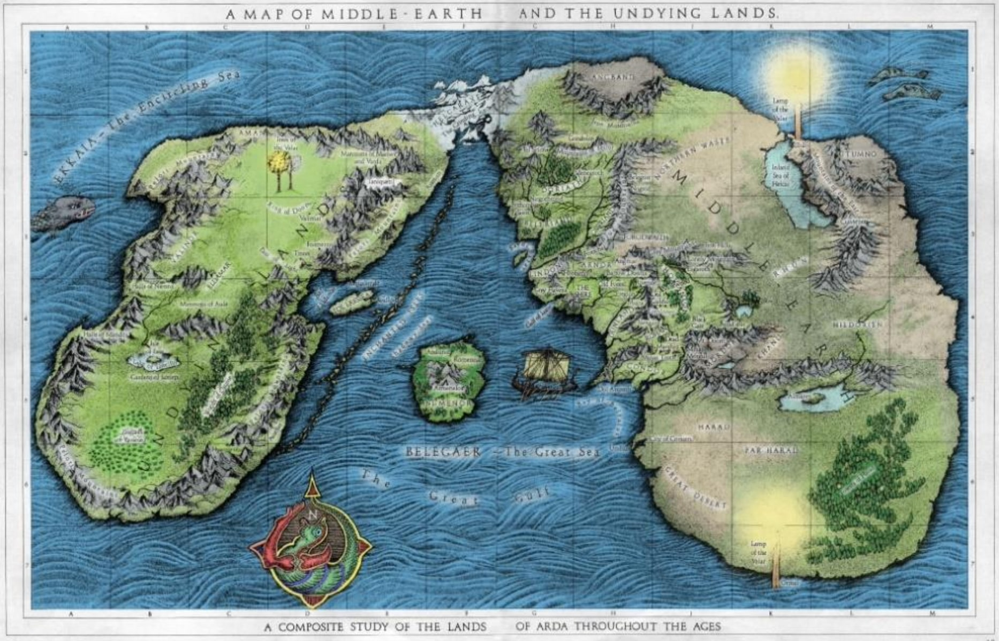

<p align="center" style="margin-top: 50px">
  
</p>

<h1 align="center">Eä System</h1>

<p align="center">
  <a href="https://en.wikipedia.org/wiki/C99">
    
  </a>
  <a href="https://github.com/bielcarpi/EaSystem">
    
  </a>
    <a href="https://opensource.org/licenses/BSD-3-Clause">
    
  </a>
</p>

<p align="center">
    Arda was created, along with the rest of Eä, by the sons of Ilúvatar. Originally a flat world, the continents were surrounded by a great ocean, Ekkaia or Circumdant Sea, and separated by Belegaer, called the Great Sea.
    <br>
    <br>
    Arda's main problem is communication between its different lands (Aman, Numenor or Endor). With a simple architecture and technology infrastructure, help is urgently needed to configure, design and implement a minimal communications system. We start from a set of devices that have a Linux operating system installed and the TCP/IP network.
    <br>
    <br>
    In a first analysis, a system was designed that will try to establish minimal connectivity to Arda. It has been called the Eä System.
</p>


## How To Use
```bash
# Clone this repository
$ git clone https://github.com/bielcarpi/EaSystem.git

# Build it for your system
$ make

# Run the Arda server
$ ./arda resources/ardaConfig.txt

# Run as many Iluvatar Sons as you want from its folders (configuring its .dat config files with the correct IPs)
$ ./iluvatarSon resources/MatagallsMatagalls1/configMatagalls1.dat
$ ./iluvatarSon resources/MatagallsMatagalls2/configMatagalls2.dat
$ ./iluvatarSon resources/PuigpedrosCano/configPuigpedros.dat
$ ./iluvatarSon resources/MontserratGaladriel/configMontserrat.dat
$ ...

# Phases 1, 2, 3, 4 and 5 of the Project are now completed
```

## Authors
Marc Cano (marc.cano@students.salle.url.edu)
<br>
Biel Carpi (biel.carpi@students.salle.url.edu)
